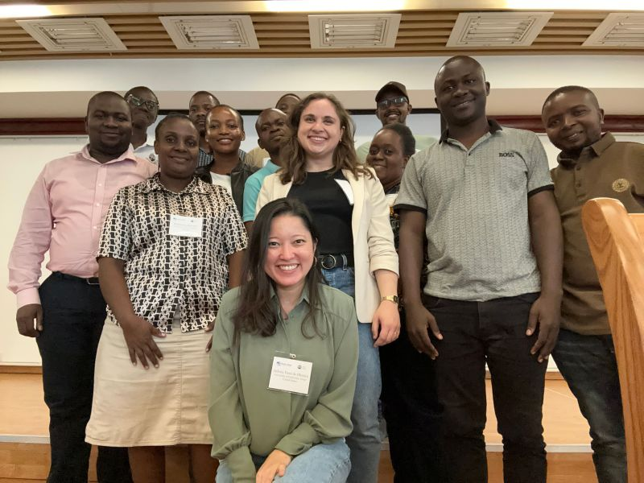

I am a PhD candidate in [Civil and Environmental Engineering](https://engineering.uci.edu/dept/cee) (Hydrology) at the University of California, Irvine in Amir AghaKouchak's [Hydroclimate Research Lab](https://amir.eng.uci.edu/index.php). My current work focuses on developing impact-based approaches to climate change attribution. More broadly, I am passionate about the role of climate scientists in accessible science communication, environmental justice, and climate policy.

# News
## PEER2PEER meeting in Dar es Salaam, Tanzania
*June 2025*: As part of the AccelNet PEER2PEER Workshop on “Advanced Technologies for Transboundary Water Resources Management: Between Science Diplomacy, Global Water Security, and Peace-building”, Debora Yumi de Oliveira and I led a training on Google Earth Engine. All materials for the training can be found on our [GitHub site](https://uci-chrs.github.io/GEE-Training-2025/). See the LinkedIn post from NASEM Capacity Development [here](https://www.linkedin.com/posts/nasemcapacity_2025peer2peer-waterresearch-hydrology-activity-7343378573379969027-ym7Y?rcm=ACoAAAazAjMBSqIqa6CkZPPGpGWOoKEKuTIlQR0). 

## UCI Team wins first place in Phase II of EPA Environmental Justice Video Challenge
*May 2023*: Our student team won first place for our video and proposal entitled "Civic Bioremediation: Building a Network of Soil Practitioners" in collaboration with Orange County Environmental Justice (OCEJ). See the press release [here](https://www.epa.gov/innovation/phase-2-winners-ej-video-challenge-students).



   

## UCI Team wins first place in Phase I of EPA Environmental Justice Video Challenge
*July 2022*: Our student team won first place for our video entitled "Unearthing Lead: The Power of Historical Maps" in collaboration with Orange County Environmental Justice (OCEJ). See the press release [here](https://www.epa.gov/innovation/phase-1-winners-ej-video-challenge-students).



